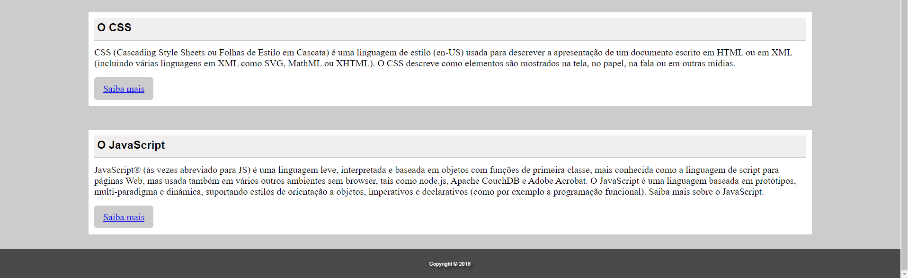

# Página SerFrontend
> um projeto de página informativa do curso serfrorntend 

Menu objetivo no canto superior direito , página de fácil navegação e botão de saiba mais sobre as linguagens abordadas em cada card.

## Meta

Lara Paixão - [Linkedin](www.linkedin.com/in/larapaixao) - lara.paixao.nascimento@gmail.com

[GitHub](https://github.com/LPaixao18)